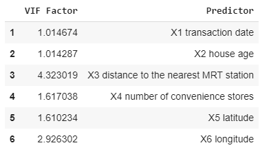
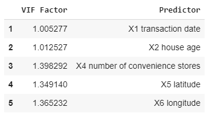
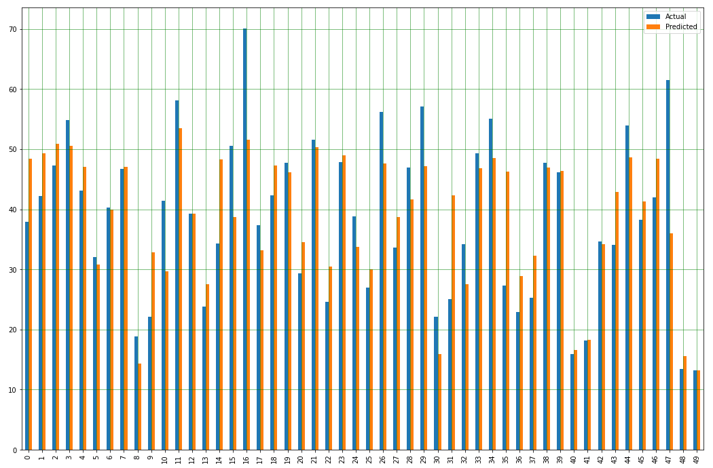
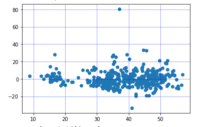
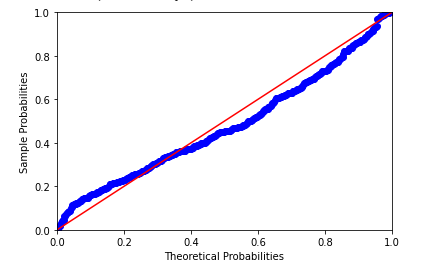
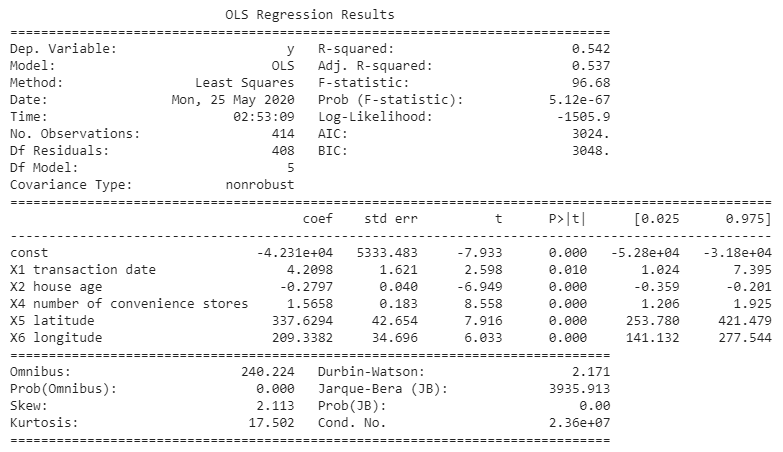
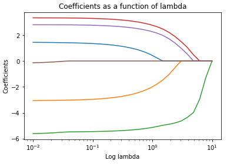
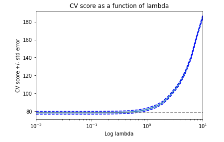

# Intro to Multiple Linear Regression Analysis in Python

**Linear Regression models** allow us to summarize and study relationships between variables
by fitting a straight line to the observed data. You may have heard of **simple linear regression**,
which establishes the relationship between two quantitative variables–one predictor variable and
one target variable.

However, in reality, it is rare that a target variable is explained by only one predictor. So
what if we want to estimate a continuous variable using more than one predictors? If two or
more predictor variables have a linear relationship with the target variable, a **multiple linear
regression analysis** allows us to quantify the strength of the relationship and estimate the target
variable at a certain value of the predictor variables.

This tutorial will show you step-by-step how to perform a multiple linear regression analysis
using Python, from checking assumptions to evaluating performance.


## Getting Started

### Import Libraries

First, let’s import all necessary libraries in the beginning to keep our code organized:

```python
import pandas as pd
import numpy as np
from scipy import stats
import statsmodels.api as sm
from statsmodels.stats.outliers_influence import variance_inflation_factor
from sklearn import datasets
from sklearn import linear_model
from sklearn import metrics
from sklearn.preprocessing import StandardScaler
from sklearn.model_selection import GridSearchCV
import matplotlib.pyplot as plt
import seaborn as sn
from random import uniform
from google.colab import files
import io
```

### Read Dataset

For this analysis, I will use a real estate dataset that can be downloaded from [here](https://www.kaggle.com/quantbruce/real-estate-price-prediction). I choose to
upload it to Google Colab from local drive. Of course, you can also replace the first argument in
read csv() with the filepath or URL to the dataset that you’d like to use instead. The delimiter
parameter is set to comma by default, but you can change it depending on the delimiter of your
csv file.

```python
uploaded = files.upload()
dataset = pd.read_csv(io.BytesIO(uploaded['Real estate.csv']), delimiter=',')
```

We can take a look at what the data looks like:

```python
dataset.head()
```


As you can see, the first column in the real estate data set is redundant, so we should probably
remove it. Otherwise, this data set seems directly usable. However, it’s likely that your own data
set will require more preprocessing–dealing with missing/invalid values, restructuring the data, and
encoding dummy variables, etc.

```python
dataset.drop(['No'], axis=1)
```

After data preprocessing, we can use the describe() function to obtain some summary statistics
of our target variable, and the displot() function from the seaborn library to plot its distribution.

```python
y = dataset['Y house price of unit area'].values # target vector
print(dataset['Y house price of unit area'].describe())
sn.distplot(y, bins = 13)
```


We see that the values of house price of unit area are normally distributed with perhaps a few
outliers on the right.


## Checking Multicollinearity

Since a multiple regression involves more than one predictor variables, multicollinearity occurs when some of them are highly correlated with each other, which means each of these predictors will account for similar variance in the target variable. Though the presence of multicollinearity will not affect the predictive power of our model, it will make it more difficult for us to assess the individual influence of a predictor on our target variable. Therefore, it is important to check the ”no multicollinearity” condition before our analysis. We can detect multicollinearity using either a correlation matrix or VIF factors.

### Correlation Matrix

The correlation coefficient is a statistic that measures linear correlation between two variables. Its
value lies between -1 and +1. The absolute value gives the strength of the relationship between the
two variables. The larger its magnitude, the stronger their relationship. In general, a correlation
coefficient above +0.8 or below -0.8 indicates a strong correlation, and we should take some measures
to reduce multicollinearity before we continue.

The pandas corr() function calculates the correlations among all variables in the dataframe.
We can visualize the resulting correlation matrix using a heatmap from the seaborn library. The
diagonal values should always equal 1 since they are the correlations of a variable with itself.

```python
df = pd.DataFrame(dataset,columns=['X1 transaction date', 'X2 house age', 'X3 distance to the nearest MRT station', 'X4 number of convenience stores', 'X5 latitude', 'X6 longitude']) # regressor matrix
corrMatrix = df.corr()
sn.heatmap(corrMatrix, annot=True) # visualize the correlation matrix using a heatmap
```


### VIF Factors

VIF factor is an alternative measure for multicollinearity, which ranges from 1 upwards. A rule of
thumb used in practice is if a VIF value is greater than 4, then multicollinearity is a problem. We
can check VIF factors using the variance inflation factor() function from the statsmodels package.

```python
X = dataset[['X1 transaction date', 'X2 house age', 'X3 distance to the nearest MRT station', 'X4 number of convenience stores', 'X5 latitude', 'X6 longitude']]
X2 = sm.add_constant(X) # augmented regressor matrix
vif = pd.DataFrame()
vif['VIF Factor'] = [variance_inflation_factor(X2.values, i) for i in range(X2.shape[1])]
vif['Predictor'] = X2.columns
vif = vif.drop(0)
vif
```



You should see in the correlation matrix that the correlation coefficient between X3 and X6 is
−0.81 < −0.8, and the VIF factor for X3 is also slightly higher than 4, which is unfavorable. A
simple solution is to remove one of the correlated variables from our model. After removing X3
from the list of column names and rerunning the previous code, the new correlation matrix should
show no significant multicollinearity, and the VIF factors of all the remaining variables are around
1, so we are in good shape, and can proceed with our regression.




But wait, you may ask, why did I choose to delete X3 rather than X6? Indeed, my choice was
kind of arbitrary here. To remove the redundant variables more carefully, we can consider using
stepwise regression to only keep the predictors that lead to the best performance; I will describe
backwards stepwise regression later.

Another way to deal with multicollinearity without having to drop your predictors before the analysis is to perform regression with regularization techniques, such as Lasso and Ridge. Regularization can help you handle multicollinearity, so if you don’t want to delete any variables, you may choose to skip the OLS model below and directly jump to the Lasso/Ridge/Elastic Net regression presented in the end.


## Performing the Regression

### A Bit of Math

Now it’s finally time to introduce our regression model. Under the linear model, the actual value
of our target variable should be a linear combination of all predictor variables plus a constant
(intercept) as well as some errors. Thus it can be written in the form of an equation $y = \beta_0 + \beta_1 X_1 + \beta_2 X_2 + \dots + \epsilon_i$, and our goal is to estimate $\beta_0$, $\beta_1$, $\beta_2$, ...

Assuming you’re not scared of matrices, let's first understand some mathematical background for linear regression in linear algebra. More generally speaking, suppose our data consisits of $n$ observations, each of which contains the values of $k$ predictor variables (not including the intercept) as well as the corresponding value of the target variable. In matrix notation, we can write the regressor matrix $\text{X}$ as  $\begin{bmatrix} 
1 & X_{11} & \dots & X_{1k} \\
1 & X_{21} & \dots & X_{2k} \\
\vdots & \vdots & \ddots & \vdots \\
1 & X_{n1} & \dots & X_{nk} \\
\end{bmatrix}$, the target vector $\mathbf{y}$ as $\begin{bmatrix} 
y_1 \\
y_2 \\
\vdots \\
y_n \\
\end{bmatrix}$, the coefficient vector $\mathbf{\beta}$ as $\begin{bmatrix} 
\beta_0 \\
\beta_1 \\
\vdots \\
\beta_k \\
\end{bmatrix}$, and the residual vector $\mathbf{\epsilon}$ as $\begin{bmatrix} 
\epsilon_1 \\
\epsilon_2 \\
\vdots \\
\epsilon_n \\
\end{bmatrix}$. Then, our linear model can be rewritten as the following: $\begin{bmatrix} 
y_1 \\
y_2 \\
\vdots \\
y_n \\
\end{bmatrix} = 
\begin{bmatrix} 
1 & X_{11} & \dots & X_{1k} \\
1 & X_{21} & \dots & X_{2k} \\
\vdots & \vdots & \ddots & \vdots \\
1 & X_{n1} & \dots & X_{nk} \\
\end{bmatrix} 
\begin{bmatrix} 
\beta_0 \\
\beta_1 \\
\vdots \\
\beta_k \\
\end{bmatrix} + 
\begin{bmatrix} 
\epsilon_1 \\
\epsilon_2 \\
\vdots \\
\epsilon_n \\
\end{bmatrix}$. Or, more simply, as $\mathbf{y} = \text{X} \mathbf{\beta} + \mathbf{\epsilon}$, where for each $i \in [1, n]$, $y_i = \beta_0 + \beta_1 X_{i1} + \beta_2 X_{i2} + \dots + \beta_k X_{ik} + \epsilon_i$.

The simplest model that we're going to start with is the ordinary least squares (OLS) regression, which aims to minimize the sum of the squared residuals $||\epsilon||^2$, which is equivalent to $|\mathbf{y} - \text{X} \mathbf{\beta}||^2$. It can be shown via matrix calculus that the least squares estimator for our coefficient vector $\mathbf{\beta}$ is given by $\mathbf{\hat{\beta}} = (\text{X}^\intercal \text{X})^{-1} \text{X}^\intercal \mathbf{y}$.

### Getting the Coefficients

The above calculation has already been implemented in the scikit-learn library so we don't need to calculate $\mathbf{\hat{\beta}}$ manually. After instantiating the LinearRegression class, we can easily obtain the coefficients along with the intercept by calling the fit() method along with our data.

```python
regressor = linear_model.LinearRegression()
regressor.fit(X, y)
coeff_df = pd.DataFrame(regressor.coef_, X.columns, columns=['Coefficient'])
# print the calculated coefficients as well as the intercept
print('Intercept                      %.6f' %(regressor.intercept_))
print(coeff_df)
```


This means, for example, that for every one unit of change in X1 transaction date, the change
in the house price of unit area is approximately 4.21.

We can compare and visualize some predicted values of the house price with the corresponding
actual values in a bar graph:

```python
y_hat = regressor.predict(X) # predicted values
df_comparison = pd.DataFrame({'Actual': y, 'Predicted': y_hat}) # put the actual and predicted values together
df_comparison = df_comparison.head(50) # show top 50 rows of this data frame
print(df_comparison)
df_comparison.plot(kind = 'bar') # visualize the comparison
plt.grid(which = 'major', linestyle = '-', linewidth = '0.5', color = 'green')
plt.grid(which = 'minor', linestyle = ':', linewidth = '0.5', color = 'black')
```





## Checking the Residuals

Congrats! You have successfully obtained the regression line. Now we can get the residuals of the regression by calculating the difference between each data point and the corresponding predicted value. In order to ensure the validity of our analysis, we need to use the residuals to verify a few more conditions apart from multicollinearity.

First, we can use the scatter() function from the matplotlib library to plot the residuals (between the actual and predicted values) against the predicted values. We expect to see that the points are randomly distributed in the scatter plot. More specifically, they should show no curvature (which ensures linearity), and constant variation along the predicted value (which ensures homoscedasticity).

```python
epsilon_hat = y - y_hat # residuals
plt.grid(color = 'b', linestyle= '--' , linewidth = 0.5)
plt.scatter(y_hat, epsilon_hat) # scatter plot
```



Finally, let’s generate a normal probability plot using probplot() to test the normality of the
residuals. If the residuals are normally distributed, the points in the normal probability plot should
stick to the red diagonal line as closely as possible. As shown in the plot below, the residuals of
our real estate model show a slight deviation from the ideal line, but the deviation or bend is not
very serious.

```python
pp = sm.ProbPlot(epsilon_hat, fit=True)
pp.ppplot(line='45') # normal probability plot
```



The above procedure indicates that our residuals satisfy the regression conditions. If, however,
your residuals do show some strong patterns, you should consider transforming your data using
negative reciprocal, logarithm, square root, square, or exponentiation and then redo the regression.
If none of the above transformation options can solve the problem, it’s possible that your data set
does not fit the linear model, and you may resort to a nonlinear model.


## Making Predictions

After all the previous conditions have been verified, you now have a trustworthy regression equation
which enables you to make some predictions if given an extra piece of data. While we can use
predict() in scikit-learn to get the mean of our prediction (like what we did when comparing the
predicted values with the actual values right after we’ve got the coefficients), confidence intervals
are available via the get prediction() in the statsmodels package. However, unlike the scikit-learn
library, statsmodels does not add a column of ones to the regressor matrix by default, so before
calling get prediction() we need to add the ones using the add constant() function.

```python
random = []
# generate random inputs
for i in range(X.shape[1]):
  random.append(uniform(X.iloc[:, i].min(), X.iloc[:, i].max()))
# print the random inputs generated
print('random input:', random)
random.insert(0, 1) # insert 1 at the front
X_aug = sm.add_constant(X) # insert 1 at the front
est = sm.OLS(y, X_aug).fit()
prediction = est.get_prediction(np.reshape(random, (1, 6)))
pd.set_option('display.max_columns', None)
print(prediction.summary_frame(alpha = 0.05))
```


Note that apart from the mean and standard error, summary frame() spits out two intervals at
95% confidence level (we have set alpha = 0.05). The first pair of lower bound and upper bound
forms a confidence interval, which is an estimate of the mean price of all the houses that match our
randomly generated data. The second pair, on the other hand, forms a prediction interval, which
estimate the price of a particular house with this set of data. Because individual values vary more
than means, we can expect the prediction interval to be wider than the confidence interval at the
same confidence level.


## Evaluations

While it is relatively straightforward to obtain regression lines and predictions, there are numerous
evaluation metrics to measure the accuracy of our model. In fact, the summary() function from
statsmodels provides you with an overwhelming amount of data:

```python
print(est.summary())
```



Don’t panic, let’s interpret some important values one by one.

### R-squared and Adjusted R-squared


R-squared, a.k.a. coefficient of determination, measures the proportion of the variance of the target variable that can be explained by the predictors in our model. $R^2$ ranges from 0 to 100\%. The higher the value, the better the model. Our model has $R^2 = 0.542$, which means approximately 54\% of the variation in the house price can be accounted for by our OLS model.

Nevertheless, $R^2$ only works as intended in a simple linear regression model with only one predictor. In a multiple regression, when a new predictor is added to the model, $R^2$ can only increase but never decrease. This implies that a model may have a higher $R^2$ simply because it has more predictors. On the other hand, the adjusted $R^2$ takes into account the number of predictors in the model. As a result, it only increases if the new predictor improves the model more than expected by chance and decreases if it fails to do so.

### F-statistic


Below $R^2$ and the adjusted $R^2$ is the F-statistic which is the statistic of an F-test checking whether our model fits the data well. The null hypothesis of the F-test is that the model with no predictors but only an intercept can fit the data as well as the proposed one. To put it simply, it's testing whether $R^2$ is significantly greater than zero. The F-statistic is the ratio of the explained variance to the unexplained variance, so a higher value of F-statistic is evidence against the null hypothesis.

The fourth row on the right gives the p-value corresponding to the F-statistic. Our model yields a very small p-value of 5.12e-67, so there is sufficient evidence to reject the null hypothesis and conclude that our model does have some predictive power.

### Confidence Intervals and t-tests


Perhaps the most important information is located in the central part of the summary. We can see
the estimated values of each coefficient in the first column, followed by an estimate of the standard
deviation of the coefficient. The last two columns provide 95% confidence intervals constructed
from the coefficients and their standard errors in the first two columns.

The two columns in the middle are the results of t-tests checking for the relevancy of each
coefficient. The null hypothesis of each t-test is that the corresponding coefficient equals zero,
meaning no linear relationship between this predictor and the target variable. The t-statistic is
the value in the first column (mean) divided by the second column (standard error); the p-values
corresponding to each t-statistic are presented in the next column. You can see that the p-values
of all our coefficients except X1 are smaller than .01, so we can safely reject the null hypotheses
and say that they are indeed relevant to predicting our target variable. However, X1 may be a
redundant variable at .01 significance level.


## Stepwise Regression

The results of the OLS regression seem significant but the real estate data set involves only 6 predictors. When we have a substantial number of predictors in the model, it's unlikely that all of them will have significant p-values. Oftentimes, there exist predictors that give redundant information. As the model increases in complexity, the variance of our estimator can get very large. Thus we may consider getting rid of some of the predictors in order to simplify the model and prevent overfitting.

In theory, we could try all possible combinations of our predictors and choose the best combination (for example, the one that yields the highest adjusted $R^2$). However, imagine your data set contains have 20 predictors, then you would need to compare $2^{20} > 1,000,000$ potential models!

Backwards stepwise regression provides an easier procedure to select reliable predictors. Starting with all predictors in the model, in each iteration we find out which predictor to delete, if any, will lead to the best model. We repeat this step until we can't improve our model by removing any variables.

The question then arises: how do we determine quantitatively which model is the best? One method to measure the performance of models is the leave-one-out cross-validation--in each iteration, we pick a data point (a row of $X_{i\cdot}$ and $y_i$) from our data set, and refit an OLS model on the remaining data points. Based on this model, we make a prediction $\hat{y}_{i}$ for the data point $y_i$ that we picked in the current iteration. We sum up the squared differences between each data point and its predicted value, i.e. $\sum_{i=1}^{n} (y_i - \hat{y}_i)^2$ as our evaluation metric, called the risk estimator. A good model should yield small difference between each pair of predicted and actual values, so smaller risk estimators are preferred.

Using the leave-one-out cross-validation, we are able to quantitatively compare the models during each iteration of backwards stepwise regression. This procedure is not supported in Python libraries, but the process is not hard to implement:

```python
X_ = dataset[['X1 transaction date', 'X2 house age', 'X3 distance to the nearest MRT station', 'X4 number of convenience stores', 'X5 latitude', 'X6 longitude']]
X_aug_ = sm.add_constant(X_) # augmented regressor matrix with a column of ones inserted at the front
min_r_cv = 0
# calculate the initial risk estimator with all predictors included
for i in range(X_.shape[0]):
  X_cv = X_aug_.drop(X_aug_.index[i])
  X_cv.reset_index(inplace=True)
  X_cv = X_cv.drop('index', axis=1)
  y_cv = np.delete(y, i)
  est_cv = sm.OLS(y_cv, X_cv).fit()
  prediction_cv = est_cv.get_prediction(X_aug_.iloc[[i]]).predicted_mean
  min_r_cv += (y[i] - prediction_cv)**2
print('original risk estimator:', min_r_cv)

variables = X_.shape[1]
min_index = -1
# keep deleting a predictor until we can't improve the model anymore
while (min_index != 0):
  min_index = 0
  # calculate the risk estimator when the j-th predictor is removed
  for j in range(1, variables + 1):
    r_cv = 0
    for i in range(X_.shape[0]):
      X_cv = X_aug_.drop(X_aug_.index[i]) # remove the i-th data point
      X_cv.reset_index(inplace = True)
      X_cv = X_cv.drop('index', axis = 1)
      X_cv.drop(X_cv.columns[[j]], axis=1, inplace=True) # remove the j-th column
      y_cv = np.delete(y, i) # remove the i-th data point
      # refit the model and make the prediction
      est_cv = sm.OLS(y_cv, X_cv).fit()
      X_aug_copy = X_aug_.iloc[[i]].copy()
      X_aug_copy.drop(X_aug_copy.columns[[j]], axis=1, inplace=True)
      prediction_cv = est_cv.get_prediction(X_aug_copy).predicted_mean
      # the risk estimator is calculated as the sum of the squared differences between each removed point and the prediction for this point
      r_cv += (y[i] - prediction_cv)**2
    # update the optimal predictor to drop if the risk estimator becomes lower
    if (r_cv < min_r_cv):
      min_index = j
      min_r_cv = r_cv
  # update the regressor matrix and the number of variables if deleting a predictor leads to a better model
  if (min_index != 0):
    X_aug_.drop(X_aug_.columns[[min_index]], axis=1, inplace=True)
    variables -= 1
print('improved risk estimator:', min_r_cv)
print('remaining predictors:', X_aug_.columns.values)
```

We can apply the above function to our real estate data, though it is too small in size to let the
above algorithm run for many rounds and make significant improvement. Still, backwards stepwise
regression reveals that X6 is the only predictor among X1-X6 that should be dropped so that the
risk estimator can be improved from 33075 to 32952 (obviously, very little improvement here).


We can try to rerun the OLS regression with X6 removed from the model. The adjusted $R^2$ now increases to 0.577. Thus to reduce multicollinearity, deleting X6 is perhaps a better option than X3.

```python
est_ = sm.OLS(y, X_aug_).fit()
print(est_.summary())
```


## Regularization

However, stepwise regression has many potential drawbacks. For example, as a greedy search algorithm, it is not guaranteed to find the best model, especially when predictors are correlated.

Another approach that performs predictor selection and also works in the presence of multicollinearity is regularization, a technique for reducing the complexity of the model by adding an extra penalty term to the errors. More specifically, our objective here is still to minimize $||\mathbf{y} - \text{X} \mathbf{\beta}||^2$ (same as the OLS model), but we now impose an additional constraint that the coefficients should not exceed some threshold. The specific constraint depends on the type of the regularization. Three popular regularization techniques are mentioned below--Lasso, Ridge, and Elastic Net.

Regardless of the type of regularization, the new model will always penalize large coefficients, so we need to standardize our predictor variables to ensure that the penalty is applied fairly across all predictors. Standardization means converting the values in each column of the regressor matrix into z-scores, so the standard score of $x$ is calculated as $z = \frac{x - \mu}{\sigma}$, where $\mu$ is the mean of all values in the same column and $\sigma$ is their standard deviation.

```python
X_std = StandardScaler().fit_transform(X_)
```

### Lasso

After the standardization, we are ready to choose a specific model to perform. Let's start with Lasso regression. Lasso regression requires that the sum of the absolute values of the coefficients $||\beta||_1$ is no larger than some prespecified value. Using Lagrange Multiplier, we can write our objective function to minimize as $||\mathbf{y} - \text{X} \mathbf{\beta}||^2_2 + \lambda ||\beta||_1$. $\lambda ||\beta||_1$ is the extra penalty term here and can be controlled by changing the value of $\lambda$. When $\lambda$ is zero, the model reduces to OLS; when $\lambda$ tends to infinity, all coefficients approach zero. As you gradually increase $\lambda$, the magnitude of the coefficients has to decrease towards zero. This can be illustrated by the code below:

```python
coefs = []
alphas = np.logspace(-2, 1, 30) # the range of the parameter
for a in alphas:
    l = linear_model.Lasso(alpha=a, fit_intercept=False)
    l.fit(X_std, y)
    coefs.append(l.coef_)
# plot log lambda on x-axis and the corresponding values of coefficients on y-axis
ax = plt.gca()
ax.plot(alphas, coefs)
ax.set_xscale('log')
plt.xlabel('Log lambda')
plt.ylabel('Coefficients')
plt.title('Coefficients as a function of lambda')
plt.axis('tight')
```



To improve the predictive power of our model, we can again resort to cross-validation and choose the $\lambda$ that optimizes some evaluation metrics, such as the cross-validated sum of squared residuals. This can be done by the GridSearchCV() function in scikit-learn. It searches over some range of $\lambda$ to find the optimal evaluation score. Note that the scoring metric is negative mean squared error since the scoring API is designed to maximize rather than minimize the score. Of course, we can easily convert the score back to positive using the negative() function in numpy.

```python
parameters_lasso = [{'alpha': alphas}]
cv_lasso = GridSearchCV(linear_model.Lasso(), parameters_lasso, scoring = 'neg_mean_squared_error')
cv_lasso.fit(X_std, y)
scores_lasso = cv_lasso.cv_results_['mean_test_score'] # the scores are negative
scores_lasso = np.negative(scores_lasso) # reverse the sign of the score
scores_std_lasso = cv_lasso.cv_results_['std_test_score'] # standard deviation
# print the optimal values
print('best score:', np.negative(cv_lasso.best_score_))
print('lambda:', cv_lasso.best_params_.get('alpha'))
```


We can visualize where the optimal value of $\lambda$ is located in the interval:

```python
# plot the cross validation score against log lambda
fig_lasso = plt.figure()
plt.semilogx(alphas, scores_lasso)
std_error_lasso = scores_std_lasso / np.sqrt(X_.shape[0])
# shade the region within 1 std err
plt.semilogx(alphas, scores_lasso + std_error_lasso, 'b--')
plt.semilogx(alphas, scores_lasso - std_error_lasso, 'b--')
plt.fill_between(alphas, scores_lasso + std_error_lasso, scores_lasso - std_error_lasso, alpha = 0.25)
plt.ylabel('CV score +/- std error')
plt.xlabel('Log lambda')
plt.axhline(np.min(scores_lasso), linestyle='--', color='.5')
plt.xlim([alphas[0], alphas[-1]])
plt.title('CV score as a function of lambda')
```



Putting the optimal value of $\lambda$ in the parameter of Lasso(), we can obtain the coefficients under the Lasso model:

```python
# print the standardized coefficients
print('Lasso Results:')
print('(Standardized)')
lasso = linear_model.Lasso(alpha = cv_lasso.best_params_.get('alpha'))
lasso.fit(X_std, y)
lasso_df = pd.DataFrame(lasso.coef_, X_.columns, columns=['Coefficient'])
print('Intercept                                 %.6f' %(lasso.intercept_))
print(lasso_df)
```


Note that X6 is again reduced to zero. The significant changes in the magnitude of other
coefficients is due to the fact that we have standardized our predictors before the regression. To
recover the interpretability of our results, we may choose to back-convert the coefficients (by dividing
by the standard deviation) and the intercept (by subtracting all the coefficients times the means of
the corresponding predictors and divided by the corresponding standard deviations):

```python
# back-convert for ease of interpretation
# beta_real = beta_std / std err
# intercept_real = intercept_std - sum of (mean * beta_std / stderr)
print('(Real)')
lasso_real = lasso_df.copy()
intercept_real = lasso.intercept_
count_lasso = lasso_real.shape[0]
for i in range(lasso_real.shape[0]):
  # decrement the total number of predictors if the coefficient is reduced to zero
  if lasso_real.iloc[i, 0] == 0:
    count_lasso -= 1
  lasso_real.iloc[i, 0] /= np.std(X_.iloc[:, i])
  intercept_real -= (lasso_real.iloc[i, 0] * np.mean(X_.iloc[:, i]))
print('Intercept                             %.6f' %(intercept_real))
print(lasso_real)
```


We can also try Ridge and Elastic Net regression. Their procedures are exactly the same except that we need to call different functions for different types of regressions.

### Ridge

For Ridge regression, the only difference is that the objective now becomes $\min\limits_{\beta} ||Y - X\beta||^2_2 + \lambda ||\beta||^2_2$. (The constraint is now on the sum of squared coefficients.) While Lasso promotes predictor selection, Ridge will decrease the values of coefficients but is unable to force a coefficient to exactly 0.

```python
print('Ridge Results:')
alphas_ridge = np.logspace(-2, 5, 30) # the range of the parameter
parameters_ridge = [{'alpha': alphas_ridge}]
cv_ridge = GridSearchCV(linear_model.Ridge(), parameters_ridge, scoring = 'neg_mean_squared_error')
cv_ridge.fit(X_std, y)
scores_ridge = cv_ridge.cv_results_['mean_test_score'] # the scores are negative
scores_ridge = np.negative(scores_ridge) # reverse the sign of the score
scores_std_ridge = cv_ridge.cv_results_['std_test_score'] # standard deviation

# plot the cross validation score against log lambda
fig_ridge = plt.figure()
plt.semilogx(alphas_ridge, scores_ridge)
std_error_ridge = scores_std_ridge / np.sqrt(X_.shape[0])
# shade the region within 1 std err
plt.semilogx(alphas_ridge, scores_ridge + std_error_ridge, 'b--')
plt.semilogx(alphas_ridge, scores_ridge - std_error_ridge, 'b--')
plt.fill_between(alphas_ridge, scores_ridge + std_error_ridge, scores_ridge - std_error_ridge, alpha = 0.25)
plt.ylabel('CV score +/- std error')
plt.xlabel('Log lambda')
plt.axhline(np.min(scores_ridge), linestyle='--', color='.5')
plt.xlim([alphas_ridge[0], alphas_ridge[-1]])
plt.title('CV score as a function of lambda')
plt.show()
# print the optimal values
print('best score:', np.negative(cv_ridge.best_score_))
print('lambda:', cv_ridge.best_params_.get('alpha'))

# print the standardized coefficients
print('(Standardized)')
ridge = linear_model.Ridge(alpha = cv_ridge.best_params_.get('alpha'))
ridge.fit(X_std, y)
ridge_df = pd.DataFrame(ridge.coef_, X_.columns, columns=['Coefficient'])
print('Intercept                                 %.6f' %(ridge.intercept_))
print(ridge_df)

# back-convert for ease of interpretation
# beta_real = beta_std / std err
# intercept_real = intercept_std - sum of (mean * beta_std / stderr)
print('\n(Real)')
ridge_real = ridge_df.copy()
ridge_intercept_real = ridge.intercept_
count_ridge = ridge_real.shape[0]
for i in range(count_ridge):
  ridge_real.iloc[i, 0] /= np.std(X_.iloc[:, i])
  ridge_intercept_real -= (ridge_real.iloc[i, 0] * np.mean(X_.iloc[:, i]))
print('Intercept                             %.6f' %(ridge_intercept_real))
print(ridge_real)
```


### Elastic Net

Lastly, Elastic Net regression is a combination of Lasso and Ridge--the objective is $\min\limits_{\beta} ||Y - X\beta||^2_2 + \lambda \left(\alpha ||\beta||_1 + \frac{1 - \alpha}{2} ||\beta||^2_2\right)$, and $\alpha = 0.5$ by default.

```python
print('Elastic Net Results:')
alphas_elastic_net = np.logspace(-2, 1, 30) # the range of the parameter
parameters_elastic_net = [{'alpha': alphas_elastic_net}]
cv_elastic_net = GridSearchCV(linear_model.ElasticNet(), parameters_elastic_net, scoring = 'neg_mean_squared_error')
cv_elastic_net.fit(X_std, y)
scores_elastic_net = cv_elastic_net.cv_results_['mean_test_score'] # the scores are negative
scores_elastic_net = np.negative(scores_elastic_net) # reverse the sign of the score
scores_std_elastic_net = cv_elastic_net.cv_results_['std_test_score'] # standard deviation

# plot the cross validation score against log lambda
fig_elastic_net = plt.figure()
plt.semilogx(alphas_elastic_net, scores_elastic_net)
std_error_elastic_net = scores_std_elastic_net / np.sqrt(X_.shape[0])
# shade the region within 1 std err
plt.semilogx(alphas_elastic_net, scores_elastic_net + std_error_elastic_net, 'b--')
plt.semilogx(alphas_elastic_net, scores_elastic_net - std_error_elastic_net, 'b--')
plt.fill_between(alphas_elastic_net, scores_elastic_net + std_error_elastic_net, scores_elastic_net - std_error_elastic_net, alpha = 0.25)
plt.ylabel('CV score +/- std error')
plt.xlabel('Log lambda')
plt.axhline(np.min(scores_elastic_net), linestyle='--', color='.5')
plt.xlim([alphas_elastic_net[0], alphas_elastic_net[-1]])
plt.title('CV score as a function of lambda')
plt.show()
# print the optimal values
print('best score:', np.negative(cv_elastic_net.best_score_))
print('lambda:', cv_elastic_net.best_params_.get('alpha'))

# print the standardized coefficients
print('(Standardized)')
elastic = linear_model.ElasticNet(alpha = cv_elastic_net.best_params_.get('alpha'))
elastic.fit(X_std, y)
elastic_df = pd.DataFrame(elastic.coef_, X_.columns, columns=['Coefficient'])
print('Intercept                                 %.6f' %(elastic.intercept_))
print(elastic_df)

# back-convert for ease of interpretation
# beta_real = beta_std / std err
# intercept_real = intercept_std - sum of (mean * beta_std / stderr)
print('\n(Real)')
elastic_real = elastic_df.copy()
elastic_intercept_real = elastic.intercept_
count_elastic = elastic_real.shape[0]
for i in range(count_elastic):
  elastic_real.iloc[i, 0] /= np.std(X_.iloc[:, i])
  elastic_intercept_real -= (elastic_real.iloc[i, 0] * np.mean(X_.iloc[:, i]))
print('Intercept                             %.6f' %(elastic_intercept_real))
print(elastic_real)
```


### Comparing Performances

Again, we can calculate the adjusted $R^2$ of each of these regressions. You can see that their values are all around 0.576, which is better than the adjusted $R^2$ of our initial OLS model.

```python
y_pred_lasso = lasso.predict(X_std) # predictions
r2_lasso = metrics.r2_score(y, y_pred_lasso) # R-squared
adj_r2_lasso = 1 - (1 - r2_lasso) * (X_.shape[0] - 1) / (X_.shape[0] - count_lasso - 1) # adjusted R-squared
print('Lasso adj. R2:', adj_r2_lasso)

y_pred_ridge = ridge.predict(X_std) # predictions
r2_ridge = metrics.r2_score(y, y_pred_ridge) # R-squared
adj_r2_ridge = 1 - (1 - r2_ridge) * (X_.shape[0] - 1) / (X_.shape[0] - count_ridge - 1) # adjusted R-squared
print('Ridge adj. R2:', adj_r2_ridge)

y_pred_elastic = elastic.predict(X_std) # predictions
r2_elastic = metrics.r2_score(y, y_pred_elastic) # R-squared
adj_r2_elastic = 1 - (1 - r2_elastic) * (X_.shape[0] - 1) / (X_.shape[0] - count_elastic - 1) # adjusted R-squared
print('Elastic Net adj. R2:', adj_r2_elastic)
```


That’s it for a complete procedure to perform linear regression analysis in Python! We have
checked the necessary conditions, calculated the coefficients under different models, and compared
their performance. If you want to find an even better regression model, perhaps you could go on
to try some nonlinear models in the future!
